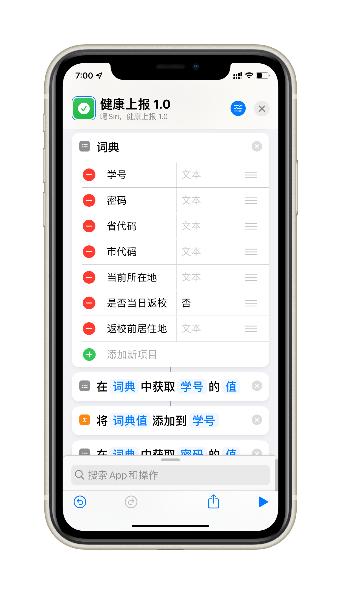
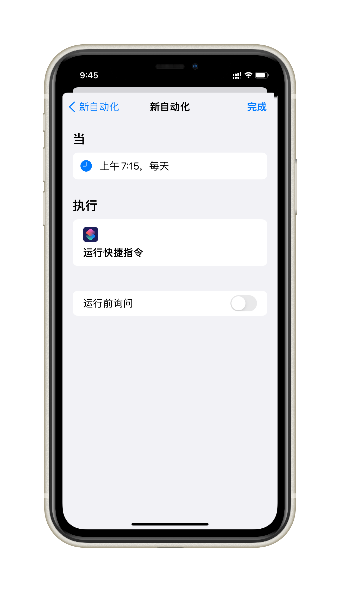

## 健康上报

### 简介

**A Shortcut for you to have a good sleep!**

### 更新说明

**获取最新版本 [v1.5](https://www.icloud.com/shortcuts/ed7b2d1e2ab54d6cb36470141d472489)**

> 2021-09-22 v1.5 同步更新"疫苗接种情况"和移除"上传健康码"选项。

> 2021-08-23 v1.4 同步更新"健康码颜色"和"返回前居住地"选项。

> 2021-08-05 v1.3 增加自动检测更新。

> 2021-08-04 v1.2 同步更新"是否在校"选项。

> 2021-03-14 v1.1 同步更新"是否在校"选项。

> 2021-02-25 v1.0 健康上报。

### 使用说明

1. 在下方词典中填写你的学号、密码等相关信息。  
（省、市代码请自行查询。例如：河南省代码为41，郑州市代码为4101）
2. 疫苗接种情况。  
（1：已接种第一针；2：已接种第二针；3：尚未接种；4：因禁忌症无法接种）
3. 在"自动化"设置定时调用此捷径。  
（可分别在凌晨和早晨设置一次，以免凌晨网络拥堵而打卡失败）
4. 若提示更新，前往 [更新地址](https://github.com/gaoyaoku/Shortcuts/main/jksb.md) 重新获取捷径即可。
5. 若因学校网站发生变化而上报失败，请暂停使用。

### 捷径设置

#### 在下方词典处填写你的个人信息

#### 设置个人自动化

#### 关闭运行前询问

